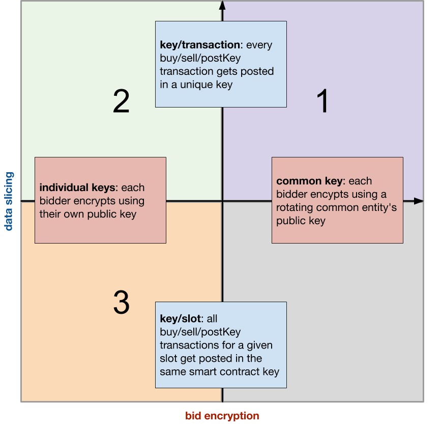

# island

A simulator for blockchain-based local energy markets.

## Dependencies

* vagrant >= 2.0
* vagrant-disksize
* virtualbox >= 6.0

If you use [Homebrew](https://brew.sh/), pick up the latest versions of all of the above like so:

```bash
brew cask install virtualbox vagrant
vagrant plugin install vagrant-disksize
```

## Setup

Clone this repo:

```bash
git clone git@github.com:kchristidis/island.git
```

cd into the `trace` directory within the `island` repo, and download `04-final-trace-2013.csv` ([link](https://drive.google.com/open?id=1snADVFVuzFOE52M9ynVvKXVvif5AJakV)) there.

## Daily operation

cd into the root directory of `island`:

```bash
vagrant up && vagrant ssh
```

When inside the VM:

```bash
make all
```

When the simulation is over, the metrics of interest are captured in the `output` folder in the `island` repo.

To enable debugging mode, set `schema.StagingLevel` to `Debug` before running the simulation.

## Concepts

### General overview

The simulated local energy market consists of `trace.IDCount` households. It runs for `schema.TraceLength` slots.

Households are equipped with solar panels, and therefore may produce their own energy. They will sell that excess energy to a neighbor, if there is demand; otherwise they will sell it back to the grid for a lower price. We do not consider a residential energy storage mechanism.

Energy is exchanged within the market using a closed-book double auction mechanism.

Each household is represented in that auction by a `bidder`.

On every slot, bidders place a `buy` offer if their energy needs are larger than their energy generation for that slot; they place a `sell` offer if the opposite applies. All bids are encrypted. The bidders are rational; the prices they pick for their bids are greater than the low price that the grid is offering to them for their surplus, and smaller than the high price that the grid is selling energy to them for. For a given slot, every bidder picks the price for their bid randomly within that price interval for a given slot.

At the end of the slot, a market clearing price is calculated (using the [dauction](https://github.com/kchristidis/dauction) library).

The simulation engine tracks the performance of the market; how much energy was bought by the grid and at which price, how much energy was sold to the grid and at which price, how much energy was traded within the market and at which market clearing price. It also tracks the performance of the underlying transaction management platform for a given experiment type; count of late transactions, problematic decryptions, size of blocks, etc. All of this information is persisted in files that are produced at the end of each run.

### Trace

The trace for every simulation tracks `trace.IDCount` households across `trace.RowCount` slots.

The expectation is that every slot should capture:

1. `trace.Gen`: the power that is generated by the house's solar panel
2. `trace.Grid`: the power that the house draws from the grid, or the power that it sends back to the grid if the value is negative
3. `trace.Use`: the aggregate of `trace.Gen` and `trace.Grid`
4. `trace.Lo`: the lower bound for the market clearing price; this is how much the grid is offering for whatever the solar panel-carrying houses generate.
5. `trace.Hi`: the upper bound for the market clearing price; this is how much the grid provider is selling its electricity to the households for.

All power values should correspond to average real power over the slot in kW.

All prices should be denominated cents per kWh.

See [kchristidis/island-input](https://github.com/kchristidis/island-input) repo for a sample trace.

### Agents

A `bidder` represents a household in the local energy market. They place a `buy` bid for slot `N` if their projected energy usage (the `trace.Use` value) for that slot is positive. They place a `sell` bid if their projected energy production (`trace.Gen`) is positive.

N.B. that this means that the prosumer tries to sell *all* of their output; instead of using it to satisfy their own needs first. This assumption does not necessarily work in favor of the individual generator (as they may end up bying energy for a higher price than they one they sell their own production for), but it contributes positively to the welfare of the local market. In practice, we do this here because we want to increase the opportunities for matching bids, as we wish to evaluate the trade clearing performance of the platform.

On a given slot, each bidder can a place of maximum of one `buy` _and_ one `sell` bid.

In Experiments 1 and 3, bidders encrypt their bids with their own unique private key per slot; as such, they are expected to post their decryption key (`postKey`) when the `PostKey` phase in that slot begins.

In Experiment 2, we introduce the concept of a `regulator`. For a given slot, all bids are encrypted using the regulator's public key. At the end of the slot, the regulator posts their private key to allow the decryption of the posted bids for that slot, and the calculation of the market clearing price. See the "Types of experiments" section for more info.

### Background threads

The `blocknotifier` checks the ledger height every `schema.SleepDuration`. If the new height corresponds to a new a slot, it notifies the `slotnotifier`. The `blocknotifier` also invokes a dummy `Clock` method on the smart contract every `schema.ClockPeriod` seconds so as to ensure a continuous stream of blocks. We need this because the passage of blocks is how the agents in the simulation track time.

The `slotnotifier` is notified by the `blocknotifier` when a new slot should be triggered, and notifies all subscribed agents (bidders and the regulator) of that event. For experiments with a separate `PostKey` phase, a second `slotnotifier` is used to signal the beginning of that phase in a given slot.

The `statscollector` thread receives block statistics from the `blocknotifier` (what is the size of a block), and transaction statistics by the agents (what kind of transaction was invoked, what was its type, result, and end-to-end latency). At the end of the run, it queries the smart contract for slot statistics, and prints all statistics to files in the `output` folder; see the "Parsing the results" section for more info.

### Smart contract

The contract encodes the primitives necessary to run the double auction. It exposes the following methods:

1. `buy` and `sell`: In Experiment 1, it persists the encrypted bid in a key (data slice) in the contract's key-value store that is common for all bids of that type (i.e. `buy` or `sell`) in that slot. In Experiments 2 and 3, it persists the encrypted bid in a key that is unique per bid in that slot.
2. `postKey`: In Experiment 1, it persists the private key for a given bid in a key that is common for all private keys in that slot. In Experiment 3, it persists the private key for a given bid in a data slice that is unique per private key in that slot. In Experiment 2, this method is not invoked; the private key will be posted by the regulator on the `markEnd` call.
3. `markEnd`: It is invoked by at the beginning of slot `N` to mark the end of slot `N-1`. In Experiment 2, the regulator uses that call to post the private key that decrypts all bids posted in slot `N-1`, so that every market participant can calculate the market clearing price locally.

For exposition across all experiments, we use this `markEnd` method to calculate the market clearing price (decode all the posted bids for slot `N-1`, create bid collections for buyers and sellers, calculate the market clearing price, post that value in the chaincode's key-value store); this is **not** necessary; across all experiments, the market participants are in a position to calculate the market clearing price for a slot locally, after the end of that slot.

If a chaincode invocation fails, it will be retried `schema.RetryCount` times, for a total of up to `schema.RetryCount + 1` times.

The wait time between retries follows an exponential backoff algorithm for better flow control; concretely, we wait anywhere from `[0, schema.Alpha * 2 ^ (currentAttemptNumber))` blocks.

### Time slotting

Each experiment runs for `schema.TraceLength` slots.

A slot consists of `schema.BlocksPerSlot` blocks. For those experiments with a `PostKey` phase (i.e. experiments 1 and 3), this phase begins `schema.BlockOffset` blocks into the slot.

A block is cut every `schema.BatchTimeout` seconds, or every `Orderer.BatchSize.MaxMessageCount` messages; whichever comes first.

The block notifier process checks the ledger for blocks every `schema.SleepDuration` seconds.

### Types of experiments

We design these along two axes: encryption keys for the posted bids, and data model (data slices) for the smart contract.



In Experiments 1 and 3, bidders encrypt their bids using their own keys. In Experiment 2, they encrypt using the public key of the regulator for that slot.

In Experiment 1, bidders post all of their buy offers for a given slot in the _same_ key in the contract's key-value store. Ditto for sell offers, or `postKey` transactions. As a result, we expect contention and MVCC read conflicts. In order to mitigate this contention somewhat, bidders always backoff exponentially even before their first attempt to post. This experiment is meant to demonstrate what can happen if the contract is not set up correctly, i.e. we expect it to be the most sub-optimal approach of the lot. In Experiments 2 and 3, every transaction updates a key in the contract's key-value store that is _unique_ to that transaction.

To change the experiment that the simulation executes, modify `schema.ExpNum`.

### Sensitivity analysis parameters

1. `schema.BlocksPerSlot`
2. `schema.BlockOffset`
3. `schema.RetryCount`
4. `schema.Alpha`
5. `schema.BatchTimeout`
6. `schema.BlocksPerslot`
7. `schema.BlockOffset`

### Parsing the results

#### Files and filenames

The program writes three files in the `output` folder:

1. block-indexed stats: `exp-MM-run-NN-block.csv`
2. slot-indexed stats: `exp-MM-run-NN-slot.csv`
3. transaction-indexed stats: `exp-MM-run-NN-tran.csv`

Where:

* `MM` identifies the experiment the simulator is performing; see `schema.ExpNum`.
* `NN` identifies the iteration of this experiment.

If you're running experiment 1 then, the first iteration of the simulation should produce the following files:

1. `exp-01-run-01-block.csv`
2. `exp-01-run-01-slot.csv`
3. `exp-01-run-01-tran.csv`

As the file extension suggests, these are comma-separated value (CSV) files.

#### Block-indexed stats (optional)

Values for each row in the `*-block.csv` file (type of value [in brackets]):

1. `block_num` [integer] (*index*): the block under inspection.	
2. `size_kib` [float]: the size of the block in [kibibytes](https://en.wikipedia.org/wiki/Kibibyte).

#### Slot-indexed stats

1. `slot_num` [integer] (*index*): the slot under inspection
2. `bfg_qty_kwh` [float]: energy bought from the grid in kWh
3. `bfg_ppu_c_per_kWh` [float]: price per unit for energy bought from the grid in US cents per kWh
4. `stg_qty_kwh` [float]: energy sold to the grid (kWh)
5. `stg_ppu_c_per_kWh` [float]: price per unit for energy sold to the grid (US cents per kWh)
6. `dmi_qty_kwh` [float]: energy needs met internally, i.e. from trading within the microgrid (kWh)
7. `dmi_ppu_c_per_kWh` [float]: price per unit for energy needs met internal (US cents per kWh)
8. `late_cnt_all` [integer]: count of late transactions, i.e. `buy`, `sell`, or `postKey` transactions that are received after a slot is marked as over (with a `markEnd` call); it is the sum of `late_cnt_buy`, `late_cnt_sell`, and `late_decrs`
9. `late_cnt_buy` [integer]: count of late `buy` transactions
10. `late_cnt_sell` [integer]: count of late `sell` transactions
11. `late_decrs` [integer]: count of late `postKey` transactions
12. `prob_iters` [integer]: count of problematic iterations; this may occur when we attempt to iterate over the keys in the contract's key-value store with a partial composite key
13. `prob_marshals` [integer]: count of problematic serializations and deserializations. This counter is incremented if an error occurs when (a) the contract attempts to serialize the JSON blob that it will send back to the invoker as a response, or (b) when the contract attempts to deserialize the call arguments, or a marshalled value in the contract's key-value store.
14. `prob_decrs` [integer]: count of problematic decryption attempts; these can happen during the `markEnd` call when we attempt to retrieve a serialized PEM-encoded private key, deserialize said key, decode said key, or decode the bid that is encrypted with said key.
15. `prob_bid_calcs` [integer]: count of problematic attempts to calculate the market clearing price during the `markEnd` call
16. `prob_keys` [integer]: count of problematic attempts to interact with a key in the contract's key-value store, i.e. read from it or write to it; it is the sum of `prob_gets` and `prob_puts`
17. `prob_gets` [integer]: count of problematic attempts to read a key from the contract's key-value store
18. `prob_puts` [integer]: count of problematic attempts to write a key to the contract's key-value store

For practitioners that wish to understand the exact context under which a slot counter is incremented, see the fields in the `MetricsOutput` struct in `chaincode/schema.go` and grep the codebase for them.

#### Transaction-indexed stats

1. `tx_id` [string] (*index*): the transaction under inspection
2. `latency_ms` [integer]: the end-to-end latency of the transaction, as observed by the client; timer starts right before the client invokes the smart contract method; timer ends when the contract response is received.
3. `tx_type` [string]: the type of the transaction; allowed values are `buy`, `sell`, `postKey`, and `markEnd`.
4. `attempt` [intger]: the attempt for this particular transaction; a transaction can be attempted up to `schema.RetryCount` times.
5. `tx_status` [string]: the result of the transaction; allowed values are `success`, or the specific error that the invocation returned.

## Credits

This repo began its life as a fork of the [heroes-service repo](https://github.com/chainHero/heroes-service). Experiments 2-3 make use of the composite keys iteration, initially demonstrated in the [high-throughput Fabric sample](https://github.com/hyperledger/fabric-samples/blob/ab46e3548c46acf1c541eca71914c20bbe212f6a/high-throughput/README.md). All Vagrant-related files were adapted from the [Fabric repo](https://github.com/hyperledger/fabric).

## Contributing

Contributions are welcome. Fork this repo and submit a pull request.
